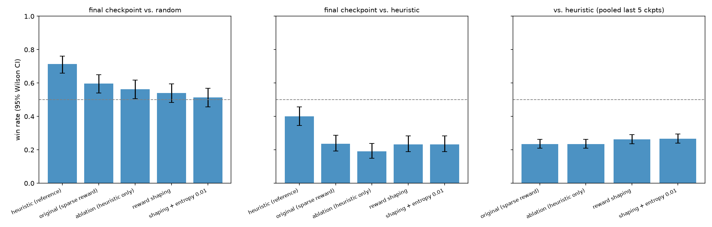
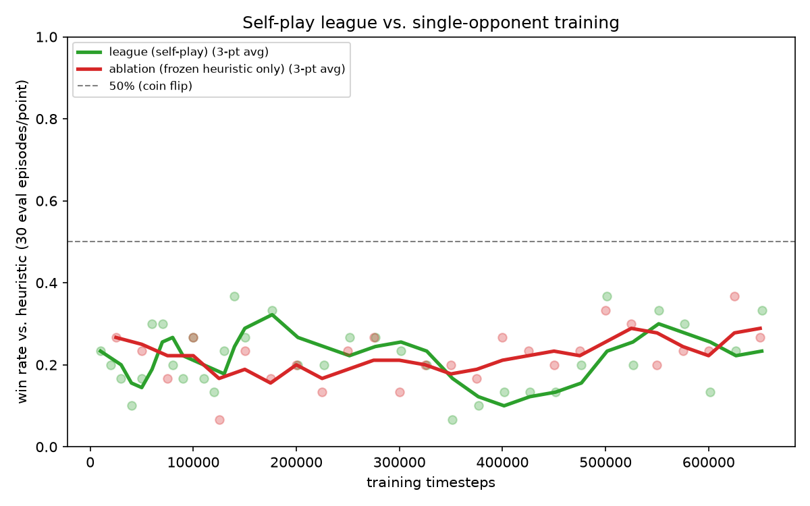
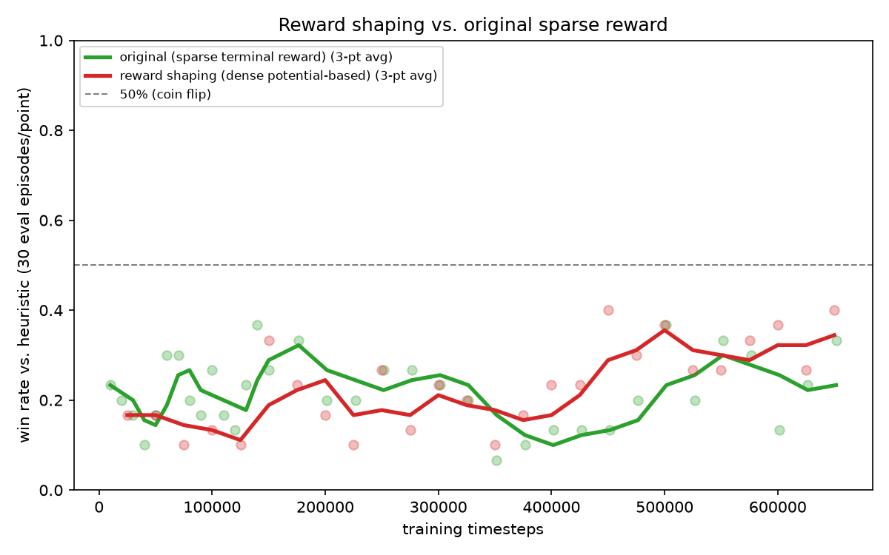
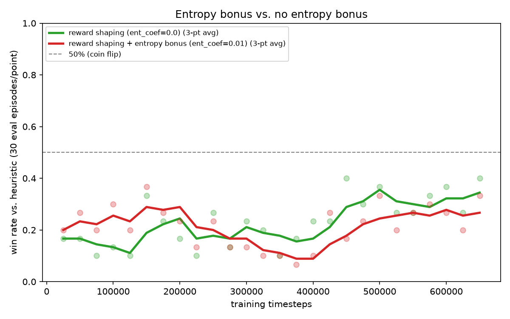

# 화투 Go-Stop RL

A from-scratch implementation of Go-Stop (고스톱), the most popular variant of the Korean card
game Hwatu (화투), with a self-play reinforcement learning agent trained to play it, served through
a FastAPI backend to a React web app you can play against.


## Why this project

Go-Stop is a real imperfect-information game with nontrivial rules (bombs, ppeok, ttadak, sweeps,
a go/stop risk decision, several scoring categories with multipliers) — enough structure to be a
genuine reinforcement learning problem, not a toy. The goal was to build the whole stack end to
end: a correctness-first rules engine, an RL training pipeline with a real evaluation methodology,
and a servable product, rather than just a notebook that trains a model once.

## Architecture

```
engine/   pure-Python rules engine (cards, dealing, capture/ppeok/ttadak/bomb resolution,
          scoring, go/stop flow) -- no RL or web dependencies at all
   ^  ^
   |  |
rl/  api/
Gym env,       FastAPI session layer,
self-play      serves the trained bot
MaskablePPO    over HTTP
training
                     ^
                     |
                   web/
             React + TS frontend
```

`engine/engine.py`'s `GoStopEngine` is the one object both `rl/env.py` (training) and
`api/session_manager.py` (serving) drive, through the identical interface
(`pending_decision` / `legal_options()` / typed action methods). There is no second rules
implementation anywhere that could quietly drift out of sync with what the model was trained
against — see [RULES.md](RULES.md) for why that mattered enough to write down every rule decision
explicitly before writing any code.

## The rules

Go-Stop has real regional/house-rule variation. [RULES.md](RULES.md) pins every rule this engine
implements — deck composition, capture resolution, ppeok, ttadak, bombs, scoring, gwang-bak/
pi-bak/meong-bak multipliers, go/stop/gobak, nagari — against sourced references, with worked
reasoning for the genuinely contested ones (ppeok sequencing especially). Every constant lives in
`engine/rules_config.py`, never hardcoded inline.

## The RL approach

- **Environment** (`rl/env.py`): a turn-based Gymnasium env. One Go-Stop "turn" can involve several
  decision points (an optional bomb declaration, playing a card, an optional go/stop call), so each
  becomes its own `env.step()` rather than one combinatorial action.
- **Action space** (`rl/action_space.py`): a single flat `Discrete(51)` — card ids 0-47 (meaning
  depends on which decision is pending), plus skip/go/stop — with a legality mask so the same
  51-slot head works across every decision type without a hierarchical policy.
- **Observation** (`rl/obs_encoding.py`): an egocentric ~250-dim vector (own hand / field / own
  captures / opponent captures / unseen-cards, plus score and turn-state scalars). "Own" always
  means "the acting player," never a fixed index, so one network plays both seats in self-play. The
  opponent's hand is never encoded directly — only merged into "unseen" — since Go-Stop is a POMDP
  and leaking hidden information would make the whole exercise pointless.
- **Algorithm**: `sb3-contrib`'s `MaskablePPO`. Masked discrete PPO for this exact
  Gymnasium-plus-mask pattern is a solved library problem; the actual engineering effort went into
  the self-play league and evaluation harness instead of reimplementing PPO.
- **Self-play league** (`rl/checkpoint_pool.py`): the opponent for each training episode is sampled
  fresh from a pool that's ~10% random, ~10% heuristic, ~80% recent checkpoints — a floor of
  non-self opponents specifically to guard against the classic self-play failure mode where two
  co-evolving policies converge on a narrow pattern that only beats each other.
- **Reward**: terminal = signed final settlement differential (scaled), 0 for nagari, plus an
  optional dense potential-based shaping term (own raw score minus opponent's, telescoping across the
  episode; `reward_shaping` in `rl/env.py`, on by default). Episode = one hand, matching how the
  go/stop mechanic is itself scoped per-hand.

## Results

Short version: the agent learned a real policy that beats random play, but **no variant I trained
beats the hand-written heuristic baseline**, and none of the changes I tried (league design, reward
shaping, entropy bonus) moved that outcome by more than a few points. The heuristic is a simple
greedy rule (take the most valuable capture available, always bomb, stop at a score/deck threshold),
so this is a genuine gap, not a strong baseline being unbeatable.



Each model's final checkpoint was re-scored on 300 fresh deals per opponent, and its last 5
checkpoints were pooled at 200 deals each (1000 games) against the heuristic. Error bars are 95%
Wilson intervals. Deals are seeded well above anything training-time evaluation used, and the
harness alternates dealer and seat so neither can bias a rate. Raw numbers: `checkpoints/final_eval.csv`
(`python -m rl.final_eval`).

| Model | vs. random (final) | vs. heuristic (final) | vs. heuristic (pooled last 5) |
|---|---|---|---|
| heuristic (reference) | 71.3% [66.0, 76.2] | 40.0% [34.6, 45.6] (vs. itself) | — |
| original (sparse terminal reward) | 59.7% [54.0, 65.1] | 23.7% [19.2, 28.8] | 23.5% [21.0, 26.2] |
| ablation (heuristic opponent only) | 56.3% [50.7, 61.8] | 19.0% [15.0, 23.8] | 23.5% [21.0, 26.2] |
| + reward shaping | 54.0% [48.3, 59.6] | 23.3% [18.9, 28.4] | 26.3% [23.7, 29.1] |
| + shaping and entropy bonus 0.01 | 51.3% [45.7, 56.9] | 23.3% [18.9, 28.4] | 26.7% [24.1, 29.5] |

(All rates are wins over all games; about 15-20% of hands end in nagari with no winner. The
heuristic-vs-itself row landing at 40% / 39% is a symmetry sanity check on the harness.)

### What the experiments show

- **Learning happened, but not far.** Every trained model beats random (roughly 51-60%), yet the
  heuristic beats random 71% of the time. The agents sit between random and the heuristic.
- **League vs. single-opponent training: no difference.** The self-play league and an agent trained
  only against the frozen heuristic score identically against the heuristic (23.5% both, pooled).
  So the league's opponent mix is not what's holding the agent back.
- **Reward shaping and entropy bonus: at most a small effect, not established.** The two runs with
  dense potential-based shaping (`reward_shaping` in `rl/env.py`) pool to about 26.5% against the
  heuristic versus 23.5% without, a gap of ~3 points. That is suggestive but borderline even on
  evaluation noise alone, and it comes from one training run per configuration, so it cannot be
  separated from run-to-run training variance. On the final snapshots alone there is no difference
  (23.3% vs 23.7%). The entropy bonus made no measurable difference on top of shaping (26.7% vs 26.3%).

### A correction worth stating

The training-time curves log only 30 games per checkpoint, roughly +/-8 points of noise. An earlier
version of this write-up read those curves as showing that reward shaping "helped in the second half
of training" (31.7% vs 25.6% late-run average) and that entropy "helped early and hurt late". The
larger re-evaluation above does not support those readings: the shaping gap shrinks to ~3 points and
the entropy effect disappears. The headline "40% vs. the heuristic" peak was the best of about 26
noisy checkpoints, so it was a lucky draw by construction. I kept the curves below for transparency but
they should be read as noisy monitoring, not as evidence.

<details>
<summary>Training-time curves (30 games per point; noisy)</summary>






</details>

### Diagnosing the plateau: can the network represent the heuristic at all?

Four different knobs all landing at ~23-27% pointed at something structural, and my leading suspect
was the observation: the network sees flattened 48-slot multi-hot vectors, so "this hand card shares
a month with that field card" has to be learned as a relation between slot indices, while the
heuristic reads it straight off the rules. A direct test is behavior cloning (`rl/behavior_cloning.py`):
train the *same* network by supervised learning to imitate the heuristic. If it can't, the
representation is the bottleneck; if it can, RL is the weak link.

Data: 20,000 games (~400k states), every state labeled with the heuristic's action, with 20% of the
*executed* moves randomized so the states aren't only the ones the heuristic itself reaches.

| | Result |
|---|---|
| Agreement with the heuristic on held-out states | **95.9%** (random guessing: 29.9%) |
| ...by decision type | play-card 95.7%, bomb 100%, go/stop 98.5% |
| Epochs to reach ~96% | about 5 |
| Cloned model vs. heuristic (300 games) | **39.3%** [34.0, 45.0], 118 wins to 122 |
| Heuristic vs. itself (reference) | 40.0% [34.6, 45.6] |
| Cloned model vs. random (300 games) | 73.3% [68.1, 78.0] (heuristic: 71.3%) |

**The hypothesis was wrong, and that is the useful result.** The observation encoding and
architecture are fine: the same network that PPO couldn't push past ~25% against the heuristic
reproduces the heuristic almost exactly, and plays at heuristic level, after a few epochs of
supervised learning. So the bottleneck is the RL procedure (credit assignment and search over a
noisy, imperfect-information game at this sample budget), not what the network can represent. That
reframes the next experiment: start PPO from the cloned policy instead of from scratch.

Known evaluation caveat: the random opponent draws from an unseeded generator, so the vs-random
columns shift by a few points between reruns (the vs-heuristic columns are exactly reproducible).

## Testing

87 pytest tests, including:
- Full rules coverage (cards, dealing, capture/ppeok/ttadak/bombs, scoring, go/stop/nagari) with
  hand-checked example hands
- A 100-seed randomized full-hand simulation that checks card conservation and termination on every
  run — this is what caught a real bug (bombs can empty a hand before the opponent's, which the
  turn loop didn't originally handle) before any ML code ever touched the engine
- A scripted cross-check that the Gym env wrapper and the raw engine reach byte-identical results
  for the same input, so there's no silent divergence between what's tested and what's trained on
- A fast end-to-end training smoke test (MaskablePPO + self-play env + checkpoint pool wired
  together) that runs in a few seconds as a permanent regression check
- API tests via FastAPI's `TestClient`, including that a session never leaks the opponent's hidden
  hand over the wire

```
.venv\Scripts\python.exe -m pytest -q
```

## Running it

Everything below assumes the venv at `.venv/` (created via `python -m venv .venv`, dependencies
from `requirements.txt` plus `torch` from the CPU wheel index — see comments in that file).

**Play in the terminal** (fastest way to sanity-check the rules by hand):
```
.venv\Scripts\python.exe scripts\play_cli.py
```

**Train** (resumes from a checkpoint if `--resume-from` is given):
```
.venv\Scripts\python.exe -m rl.train --timesteps 150000
.venv\Scripts\python.exe -m rl.plotting
```

**Clone the heuristic by supervised learning** (the diagnostic above; writes `checkpoints_bc/`):
```
.venv\Scripts\python.exe -m rl.behavior_cloning --games 20000
```

**Re-score every run with confidence intervals:**
```
.venv\Scripts\python.exe -m rl.final_eval
```

**Evaluate baselines head-to-head:**
```
.venv\Scripts\python.exe -m rl.evaluate
```

**Serve the API** (loads the most recent checkpoint, or falls back to the heuristic bot if none
exists yet):
```
.venv\Scripts\python.exe -m uvicorn api.main:app --port 8000
```

**Run the web app** (in a second terminal, with the API running):
```
cd web
npm install
npm run dev
```

## Project layout

```
engine/    rules engine -- see RULES.md
rl/        Gym env, action/observation encoding, baselines, self-play PPO training, evaluation
api/       FastAPI session + bot-inference layer
web/       React + TypeScript frontend
scripts/   play_cli.py -- terminal play for manual sanity-checking
tests/     87 pytest tests across all of the above
checkpoints/  trained model checkpoints (gitignored) + training_log.csv + the curve plot
```

## What's deliberately out of scope for v1

3-player Go-Stop (the engine's dealing is player-count-generic, but go/stop settlement assumes 2),
the heundeul/"shake" declaration, Elo-weighted league sampling, and deployment/hosting — see
RULES.md and the project plan for the reasoning. None of these move the needle on the core
engineering/ML story the way the rules-correctness suite, the training curve, and the reused-engine
architecture do.
