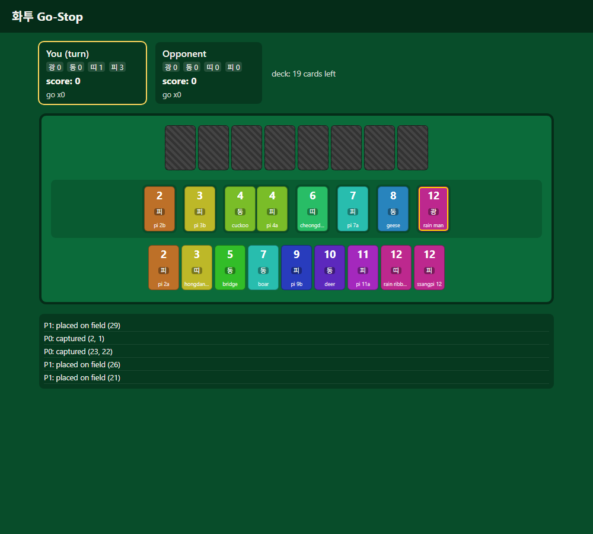
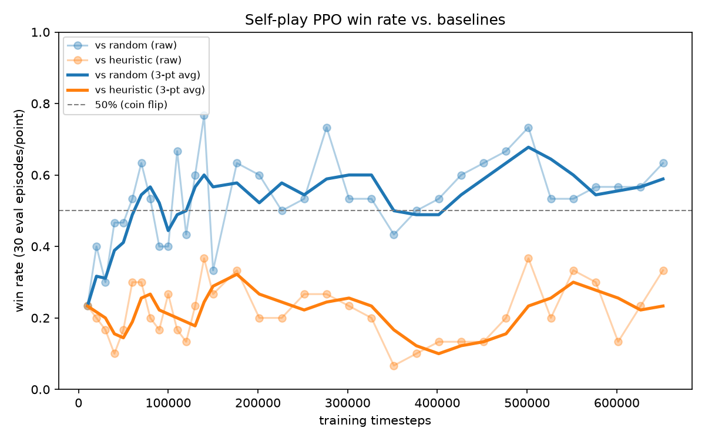

# 화투 Go-Stop RL

A from-scratch implementation of Go-Stop (고스톱), the most popular variant of the Korean card
game Hwatu (화투), with a self-play reinforcement learning agent trained to play it, served through
a FastAPI backend to a React web app you can play against.



## Why this project

Go-Stop is a real imperfect-information game with nontrivial rules (bombs, ppeok, ttadak, sweeps,
a go/stop risk decision, several scoring categories with multipliers) — enough structure to be a
genuine reinforcement learning problem, not a toy. The goal was to build the whole stack end to
end: a correctness-first rules engine, an RL training pipeline with a real evaluation methodology,
and a servable product, rather than just a notebook that trains a model once.

## Architecture

```
engine/   pure-Python rules engine (cards, dealing, capture/ppeok/ttadak/bomb resolution,
          scoring, go/stop flow) -- no RL or web dependencies at all
   ^  ^
   |  |
rl/  api/
Gym env,       FastAPI session layer,
self-play      serves the trained bot
MaskablePPO    over HTTP
training
                     ^
                     |
                   web/
             React + TS frontend
```

`engine/engine.py`'s `GoStopEngine` is the one object both `rl/env.py` (training) and
`api/session_manager.py` (serving) drive, through the identical interface
(`pending_decision` / `legal_options()` / typed action methods). There is no second rules
implementation anywhere that could quietly drift out of sync with what the model was trained
against — see [RULES.md](RULES.md) for why that mattered enough to write down every rule decision
explicitly before writing any code.

## The rules

Go-Stop has real regional/house-rule variation. [RULES.md](RULES.md) pins every rule this engine
implements — deck composition, capture resolution, ppeok, ttadak, bombs, scoring, gwang-bak/
pi-bak/meong-bak multipliers, go/stop/gobak, nagari — against sourced references, with worked
reasoning for the genuinely contested ones (ppeok sequencing especially). Every constant lives in
`engine/rules_config.py`, never hardcoded inline.

## The RL approach

- **Environment** (`rl/env.py`): a turn-based Gymnasium env. One Go-Stop "turn" can involve several
  decision points (an optional bomb declaration, playing a card, an optional go/stop call), so each
  becomes its own `env.step()` rather than one combinatorial action.
- **Action space** (`rl/action_space.py`): a single flat `Discrete(51)` — card ids 0-47 (meaning
  depends on which decision is pending), plus skip/go/stop — with a legality mask so the same
  51-slot head works across every decision type without a hierarchical policy.
- **Observation** (`rl/obs_encoding.py`): an egocentric ~250-dim vector (own hand / field / own
  captures / opponent captures / unseen-cards, plus score and turn-state scalars). "Own" always
  means "the acting player," never a fixed index, so one network plays both seats in self-play. The
  opponent's hand is never encoded directly — only merged into "unseen" — since Go-Stop is a POMDP
  and leaking hidden information would make the whole exercise pointless.
- **Algorithm**: `sb3-contrib`'s `MaskablePPO`. Masked discrete PPO for this exact
  Gymnasium-plus-mask pattern is a solved library problem; the actual engineering effort went into
  the self-play league and evaluation harness instead of reimplementing PPO.
- **Self-play league** (`rl/checkpoint_pool.py`): the opponent for each training episode is sampled
  fresh from a pool that's ~10% random, ~10% heuristic, ~80% recent checkpoints — a floor of
  non-self opponents specifically to guard against the classic self-play failure mode where two
  co-evolving policies converge on a narrow pattern that only beats each other.
- **Reward**: 0 during play, terminal = signed final score differential (scaled), 0 for nagari.
  Episode = one hand, matching how the go/stop mechanic is itself scoped per-hand.

## Results



Reported honestly rather than cherry-picked, across a full 650k-timestep run (an initial 150k plus
a 500k continuation from that checkpoint):

- **vs. random**: real learning, and it holds up. Win rate climbs from ~25% to a 50-65% band within
  the first ~60k steps and stays there for the rest of training — the agent reliably beats random
  play, it just doesn't keep improving past that plateau.
- **vs. heuristic**: never sustainably crosses 50%. It oscillates noisily in roughly a 10-37% band
  the entire run, including a visible dip to its worst performance (~7-15%) between 350k-450k steps
  before partially recovering back to 20-33% by the end. There is no clean upward trend against the
  stronger baseline across 650k steps of training.

**Reading this honestly:** the agent learned a real policy (decisively better than random), but
plateaued below the heuristic baseline rather than closing the gap with more timesteps alone. The
likely causes, roughly in order of suspicion:
1. **Reward sparsity** — a single terminal reward over an ~10-20 step episode is a long credit
   assignment horizon for vanilla PPO with no shaping.
2. **League composition** — the self-play pool is only 10% random / 10% heuristic / 80% recent
   checkpoints; if the checkpoints in that 80% are themselves not much stronger than random, the
   agent is rarely practicing against something as tough as the heuristic actually is, so there's
   little pressure to specifically get better than it.
3. **No hyperparameter tuning** — both runs used the same default-ish PPO settings (net size,
   entropy coefficient, learning rate) picked before seeing any results, not tuned in response to
   the plateau.

More timesteps alone (150k -> 650k) did not resolve this, which is itself the useful finding: it
points at the league/reward design rather than "just needs to train longer" as the next thing to
change. `rl/evaluate.py` is the harness behind every number here — it alternates both the dealer
and which seat each policy occupies across episodes so neither a dealer-order nor a seat-index
artifact can bias a reported win rate.

`rl/evaluate.py` is the harness behind every number here — it alternates both the dealer and which
seat each policy occupies across episodes so neither a dealer-order nor a seat-index artifact can
bias a reported win rate.

## Testing

78 pytest tests, including:
- Full rules coverage (cards, dealing, capture/ppeok/ttadak/bombs, scoring, go/stop/nagari) with
  hand-checked example hands
- A 100-seed randomized full-hand simulation that checks card conservation and termination on every
  run — this is what caught a real bug (bombs can empty a hand before the opponent's, which the
  turn loop didn't originally handle) before any ML code ever touched the engine
- A scripted cross-check that the Gym env wrapper and the raw engine reach byte-identical results
  for the same input, so there's no silent divergence between what's tested and what's trained on
- A fast end-to-end training smoke test (MaskablePPO + self-play env + checkpoint pool wired
  together) that runs in a few seconds as a permanent regression check
- API tests via FastAPI's `TestClient`, including that a session never leaks the opponent's hidden
  hand over the wire

```
.venv\Scripts\python.exe -m pytest -q
```

## Running it

Everything below assumes the venv at `.venv/` (created via `python -m venv .venv`, dependencies
from `requirements.txt` plus `torch` from the CPU wheel index — see comments in that file).

**Play in the terminal** (fastest way to sanity-check the rules by hand):
```
.venv\Scripts\python.exe scripts\play_cli.py
```

**Train** (resumes from a checkpoint if `--resume-from` is given):
```
.venv\Scripts\python.exe -m rl.train --timesteps 150000
.venv\Scripts\python.exe -m rl.plotting
```

**Evaluate baselines head-to-head:**
```
.venv\Scripts\python.exe -m rl.evaluate
```

**Serve the API** (loads the most recent checkpoint, or falls back to the heuristic bot if none
exists yet):
```
.venv\Scripts\python.exe -m uvicorn api.main:app --port 8000
```

**Run the web app** (in a second terminal, with the API running):
```
cd web
npm install
npm run dev
```

## Project layout

```
engine/    rules engine -- see RULES.md
rl/        Gym env, action/observation encoding, baselines, self-play PPO training, evaluation
api/       FastAPI session + bot-inference layer
web/       React + TypeScript frontend
scripts/   play_cli.py -- terminal play for manual sanity-checking
tests/     78 pytest tests across all of the above
checkpoints/  trained model checkpoints (gitignored) + training_log.csv + the curve plot
```

## What's deliberately out of scope for v1

3-player Go-Stop (the engine's dealing is player-count-generic, but go/stop settlement assumes 2),
the heundeul/"shake" declaration, Elo-weighted league sampling, and deployment/hosting — see
RULES.md and the project plan for the reasoning. None of these move the needle on the core
engineering/ML story the way the rules-correctness suite, the training curve, and the reused-engine
architecture do.
