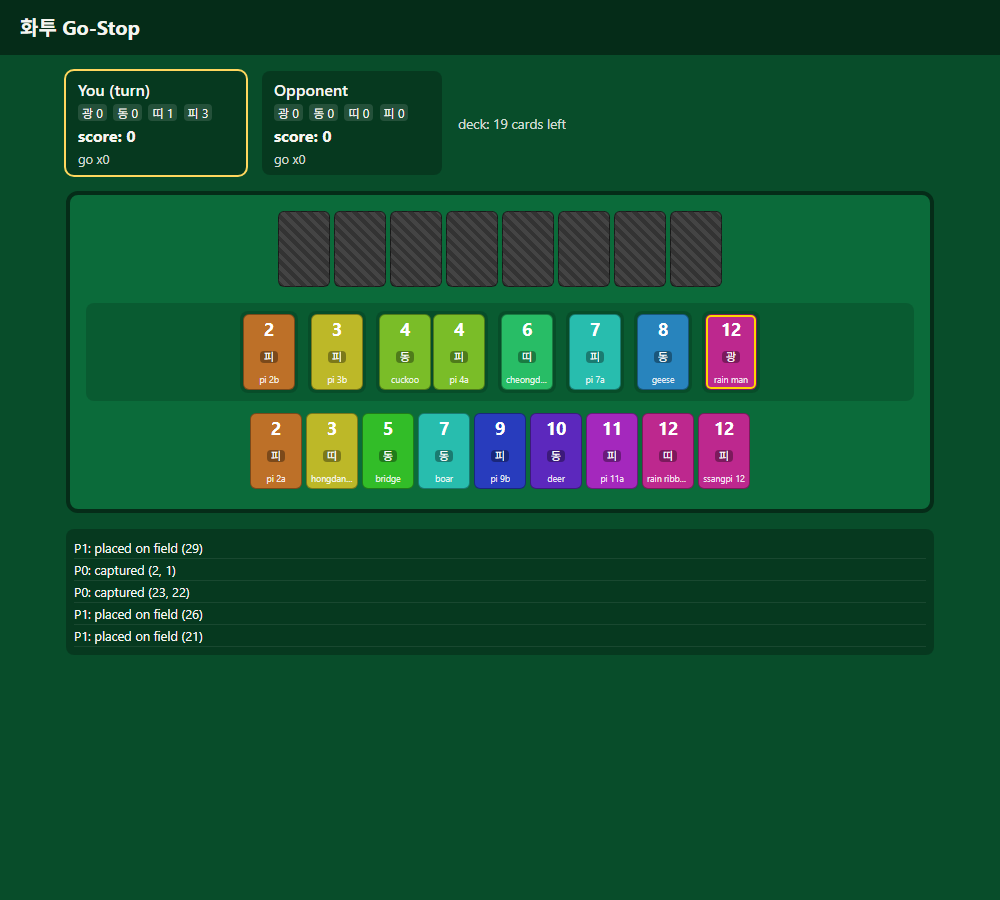
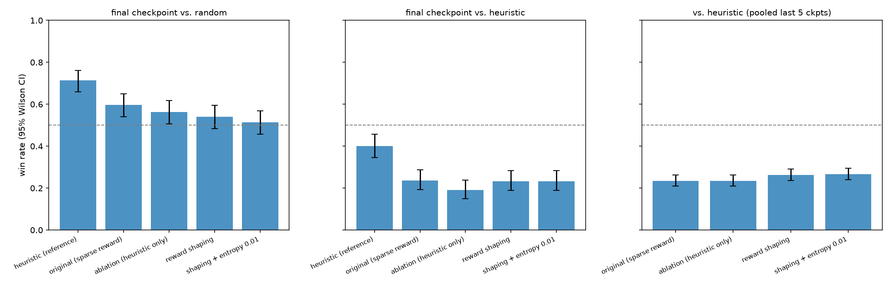
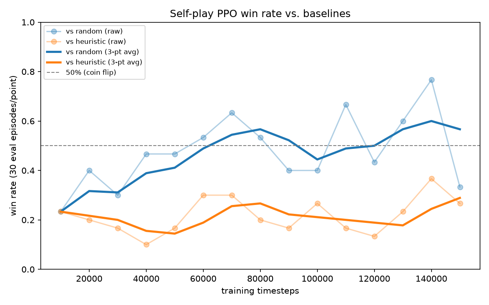
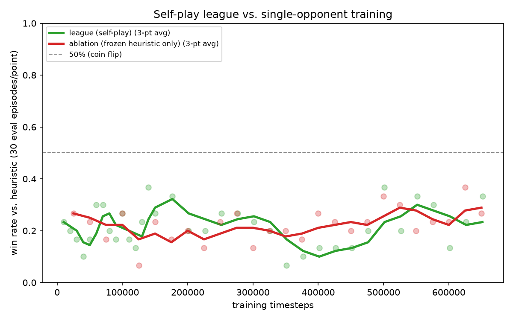
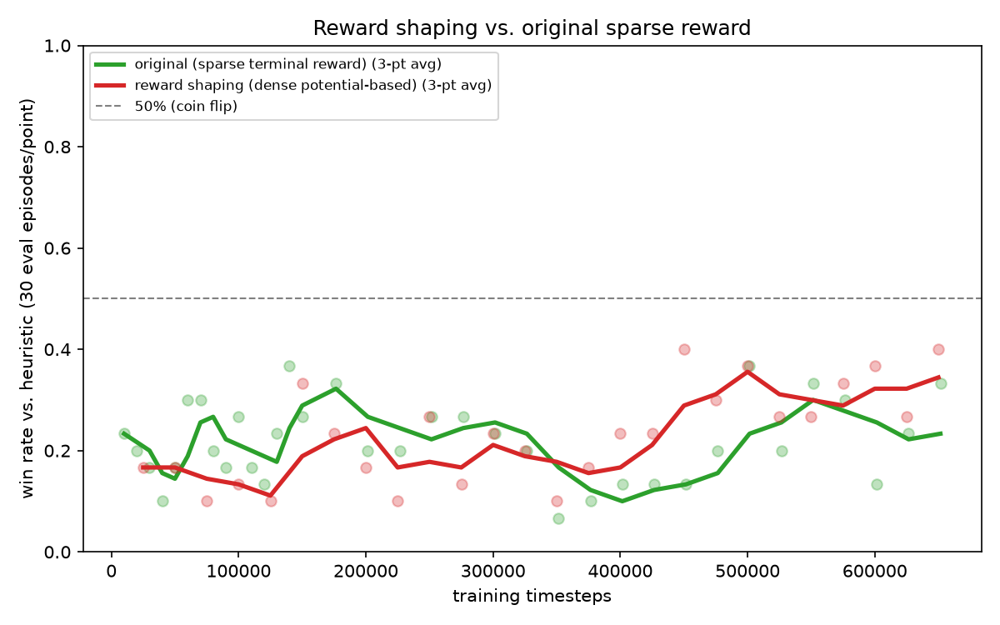
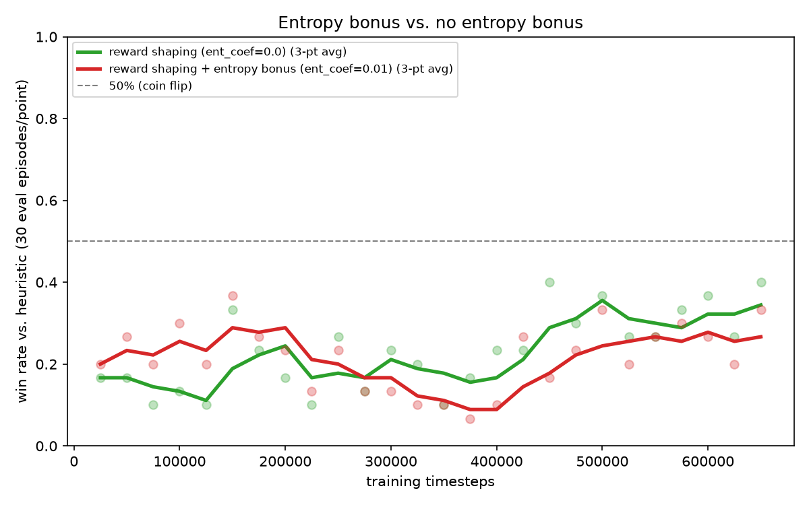

# 화투 Go-Stop RL

[](https://github.com/yubyunghun/hwatu-gostop-rl/actions/workflows/ci.yml)

A from-scratch implementation of Go-Stop (고스톱), the most popular variant of the Korean card
game Hwatu (화투), with a self-play reinforcement learning agent trained to play it, served through
a FastAPI backend to a React web app you can play against.



## Why this project

Go-Stop is a real imperfect-information game with nontrivial rules (bombs, ppeok, sweeps,
a go/stop risk decision, several scoring categories with multipliers) — enough structure to be a
genuine reinforcement learning problem, not a toy. The goal was to build the whole stack end to
end: a correctness-first rules engine, an RL training pipeline with a real evaluation methodology,
and a servable product, rather than just a notebook that trains a model once.

## Architecture

```
engine/   pure-Python rules engine (cards, dealing, capture/ppeok/bomb resolution,
          scoring, go/stop flow) -- no RL or web dependencies at all
   ^  ^
   |  |
rl/  api/
Gym env,       FastAPI session layer,
self-play      serves the trained bot
MaskablePPO    over HTTP
training
                     ^
                     |
                   web/
             React + TS frontend
```

`engine/engine.py`'s `GoStopEngine` is the one object both `rl/env.py` (training) and
`api/session_manager.py` (serving) drive, through the identical interface
(`pending_decision` / `legal_options()` / typed action methods). There is no second rules
implementation anywhere that could quietly drift out of sync with what the model was trained
against — see [RULES.md](RULES.md) for why that mattered enough to write down every rule decision
explicitly before writing any code.

## The rules

Go-Stop has real regional/house-rule variation. [RULES.md](RULES.md) pins every rule this engine
implements — deck composition, capture resolution, ppeok, bombs, scoring, gwang-bak/
pi-bak/meong-bak multipliers, go/stop/gobak, nagari — against sourced references, with worked
reasoning for the genuinely contested ones (ppeok sequencing especially). Every constant lives in
`engine/rules_config.py`, never hardcoded inline.

## The RL approach

- **Environment** (`rl/env.py`): a turn-based Gymnasium env. One Go-Stop "turn" can involve several
  decision points (an optional bomb declaration, playing a card, an optional go/stop call), so each
  becomes its own `env.step()` rather than one combinatorial action.
- **Action space** (`rl/action_space.py`): a single flat `Discrete(51)` — card ids 0-47 (meaning
  depends on which decision is pending), plus skip/go/stop — with a legality mask so the same
  51-slot head works across every decision type without a hierarchical policy.
- **Observation** (`rl/obs_encoding.py`): an egocentric ~250-dim vector (own hand / field / own
  captures / opponent captures / unseen-cards, plus score and turn-state scalars). "Own" always
  means "the acting player," never a fixed index, so one network plays both seats in self-play. The
  opponent's hand is never encoded directly — only merged into "unseen" — since Go-Stop is a POMDP
  and leaking hidden information would make the whole exercise pointless.
- **Algorithm**: `sb3-contrib`'s `MaskablePPO`. Masked discrete PPO for this exact
  Gymnasium-plus-mask pattern is a solved library problem; the actual engineering effort went into
  the self-play league and evaluation harness instead of reimplementing PPO.
- **Self-play league** (`rl/checkpoint_pool.py`): the opponent for each training episode is sampled
  fresh from a pool that's ~10% random, ~10% heuristic, ~80% recent checkpoints — a floor of
  non-self opponents specifically to guard against the classic self-play failure mode where two
  co-evolving policies converge on a narrow pattern that only beats each other.
- **Reward**: terminal = signed final settlement differential (scaled), 0 for nagari, plus an
  optional dense potential-based shaping term (own raw score minus opponent's, telescoping across the
  episode; `reward_shaping` in `rl/env.py`, on by default). Episode = one hand, matching how the
  go/stop mechanic is itself scoped per-hand.

## Results

Short version: **imitation learning reproduces a hand-written heuristic exactly, PPO from scratch never
gets close, and PPO fine-tuning from the imitation start earns about 3.4 more points per game than the
heuristic while winning about as many hands.** The gain comes from the go/stop decision, not from better
card play, and it is specific to how this game's payoffs work (details below). The heuristic is a simple
greedy rule (take the most valuable capture available, always bomb, stop at a score/deck threshold),
so matching it is a real bar, not a strawman.
Search on top of the same heuristic is the one method here that beats it at card play (+2.4 points per
game and about 7 more wins per 100 hands with card-play search alone), and distilling search into the
network produces the highest win rate of any model tried, via sharper go/stop judgment rather than
cleaner mechanics (see the last two subsections).



**Protocol.** Each model's final checkpoint was scored on 600 held-out deals per opponent, and each
run's last 5 checkpoints were pooled at 200 deals each (1000 games) against the heuristic. Error bars
are 95% Wilson intervals. Deal seeds sit far above anything training-time evaluation used, and seat
and dealer are varied independently so the policy under test moves first in half the games and second
in the other half (see the second correction below for why that sentence matters). Raw numbers:
`checkpoints/final_eval.csv` (`python -m rl.final_eval`).

### Win rate

| Model | vs. random (final) | vs. heuristic (final) | vs. heuristic (pooled last 5) |
|---|---|---|---|
| heuristic (reference) | 71.0% [67.2, 74.5] | 37.3% [33.6, 41.3] (vs. itself) | n/a |
| PPO from scratch, sparse reward | 54.7% [50.7, 58.6] | 21.5% [18.4, 25.0] | 22.2% [19.7, 24.9] |
| ...against the heuristic only (no league) | 50.0% [46.0, 54.0] | 21.7% [18.6, 25.1] | 23.6% [21.1, 26.3] |
| ...+ reward shaping | 56.2% [52.2, 60.1] | 24.5% [21.2, 28.1] | 23.6% [21.1, 26.3] |
| ...+ shaping and entropy bonus | 55.8% [51.8, 59.8] | 21.8% [18.7, 25.3] | 25.3% [22.7, 28.1] |
| **cloned heuristic (behavior cloning)** | 71.7% [67.9, 75.1] | **37.0%** [33.2, 40.9] | 39.1% [36.1, 42.2] |
| **cloning + PPO fine-tune** | 74.3% [70.7, 77.7] | **38.5%** [34.7, 42.5] | 38.0% [35.0, 41.0] |

(Rates are wins over all games. About 19% of hands end in nagari with no winner, which is why the
heuristic playing itself scores 37%, not 50%.)

On win rate the picture is simple: the four from-scratch variants sit 12-16 points below the heuristic
with non-overlapping intervals, and the cloned and fine-tuned models are statistically
indistinguishable from it. League vs. heuristic-only training, reward shaping, and the entropy bonus
made no measurable difference (all 22-25% pooled, well inside each other's error bars).

### Payoff: what PPO actually optimizes

Win rate counts who won. PPO is trained on the final settlement, so a policy can earn more per game
without winning more games. Mean payoff (points per game against the heuristic, nagari = 0) is noisy
because deal luck dominates it, so the comparison that matters is the *paired* difference: the same
deals, the same seats, the model minus the heuristic playing that position.

| Model (3000 fresh deals) | Mean payoff | Paired vs. heuristic | Wins / losses | Average win / loss |
|---|---|---|---|---|
| heuristic vs. itself (sanity: ~0) | -0.09 [-0.71, +0.52] | n/a | 1231 / 1227 | +15.2 / -15.4 |
| cloned heuristic | -0.08 [-0.70, +0.54] | +0.01 [-0.22, +0.25] | 1235 / 1225 | +15.3 / -15.7 |
| **cloning + PPO fine-tune** | **+3.30** [+2.05, +4.55] | **+3.39** [+2.33, +4.45] | 1182 / 1265 | **+25.6** / -16.1 |

A first pass at 1000 deals suggested this, and it is replicated here on a fresh seed with three
times the games (+3.71 [+2.06, +5.36] on the first set). PPO from scratch is about 5.5 points per
game *worse* than the heuristic (paired -5.2 to -5.4). Raw numbers: `checkpoints/payoff_eval*.json`.

**Where the gain comes from.** The fine-tuned model wins about the same number of hands as the clone
(1182 vs. 1235 of 3000, not a significant difference) but its average win is worth 25.6 points instead
of 15.3, with losses about the same size. Decision-level analysis (`python -m rl.analyze_behavior`, 300
games against the heuristic) says why:

| Decision | Heuristic | Cloned | Fine-tuned | PPO from scratch |
|---|---|---|---|---|
| Takes an available capture | 100% | 100% | 99.9% | **65.6%** |
| Picks the most valuable capture | 99.5% | 98.7% | 98.0% | 65.1% |
| Declares a bomb when able | 100% | 100% | 100% | **66.7%** |
| Discards its lowest-value card when it can't capture | 100% | 98.8% | 74.5% | 60.0% |
| Keeps going ("Go") when it could stop | 82.5% | 82.9% | **99.4%** | 57.5% |

The fine-tuned model is not a better card player: it matches the heuristic on captures and bombs and
is looser about what it discards. What it learned is to press "Go" almost every time it qualifies,
which collects the per-go bonus and the multiplier on the hands it wins. The heuristic stops
conservatively (at a score, a go count, or a nearly empty deck), so under this game's payoff rules
that is a real improvement the reward could find and a hand-written threshold missed. It is also a
narrow one, and worth stating plainly:

- It depends on this project's settlement rules (the go bonus, the multiplier that doubles per go
  from the third, gobak) and on the heuristic's cautious stop rule. It is exploiting the payoff
  structure, not demonstrating general Go-Stop skill, and it would not show up if the objective were
  win probability, where it is level with the heuristic.
- It is higher variance (a 25.6-point average win), and it does slightly worse on the hands where it
  does not win.
- The from-scratch models fail at something more basic: they skip an available capture about a third
  of the time and pass on free bombs, which explains their win rate better than any of the knobs I
  tuned. They never learned "capture when you can" in 650k steps.

### Corrections

Three things I got wrong and fixed, kept here because they change how much to trust the numbers.

1. **Training-time curves are too noisy to read.** They log 30 games per checkpoint, roughly +/-8
   points. An earlier version of this write-up read them as showing that reward shaping "helped in
   the second half of training" and that entropy "helped early and hurt late", and quoted a 40% peak
   against the heuristic. The larger re-evaluation does not support any of that; the peak was the best
   of about 26 noisy checkpoints, so a lucky draw by construction.
2. **The evaluation harness had a position bias.** It alternated the dealer and the policy's seat
   *together*, and because the first mover is `(dealer + 1) % 2` the two effects cancelled: the
   policy under test moved second in every evaluation game, and this README claimed the opposite. I
   caught it because the heuristic playing itself scored a payoff of +1.71 [+1.12, +2.31] where symmetry
   requires 0. The schedule is now `rl.evaluate.episode_setup`, with tests pinning that the policy
   moves first in exactly half of games, and every table above was regenerated. Comparisons between
   models were unaffected (they shared the bias) but absolute rates moved several points, for example
   the heuristic against itself went from 43.7% to 37.3%. The payoff result was found after the win-rate
   comparison came up flat, so it is exploratory; that is why it was re-tested on a fresh seed.
3. **The capture rule for matching 2 field cards was wrong, and every number above was produced
   against the wrong version.** A hand card or forced draw matching 2 same-month field cards used
   to auto-capture all 3 immediately. A user who actually plays this game pointed out that's not
   how it works: you choose which one to pair with, and the other stays on the field. Checking it
   against pagat (this project's primary source) confirmed the user was right -- the old behavior
   happened to match a different source (gostopguide) that disagrees with pagat here, which is how
   it got built that way without anyone (including me) noticing it was a real choice, not a
   citation I'd actually checked. Fixed in `engine/capture.py`/`engine/engine.py` as a real decision
   node (`CAPTURE_CHOICE`), which also meant retiring the "ttadak" bonus entirely, since it only
   ever existed as a side effect of the old (wrong) auto-capture behavior -- see RULES.md #4/#6.
   This is a rules-correctness fix, not an evaluation-methodology one, and it changes the actual
   game every model above was trained and measured against. It doesn't make the comparisons
   between those models meaningless (they were all measured consistently against each other, on
   the same engine), but none of the numbers above are "real Go-Stop" numbers in the way the rest
   of this README implies, and retraining/re-evaluating against the corrected engine is a planned
   follow-up, not yet done as of this fix.

The training-time logs in `checkpoints*/training_log.csv` still carry the old bias (they were written
before the fix), which does not matter for how they are used here: as noisy monitoring only.

<details>
<summary>Training-time curves (30 games per point; noisy, pre-fix harness)</summary>






</details>

### Diagnosing the plateau: can the network represent the heuristic at all?

Four different knobs all landing at the same level pointed at something structural, and my leading
suspect was the observation: the network sees flattened 48-slot multi-hot vectors, so "this hand card
shares a month with that field card" has to be learned as a relation between slot indices, while the
heuristic reads it straight off the rules. A direct test is behavior cloning
(`rl/behavior_cloning.py`): train the *same* network by supervised learning to imitate the heuristic.
If it can't, the representation is the bottleneck; if it can, RL is the weak link.

Data: 20,000 games (~400k states), every state labeled with the heuristic's action, with 20% of the
*executed* moves randomized so the states aren't only the ones the heuristic itself reaches.

| | Result |
|---|---|
| Agreement with the heuristic on held-out states | **95.9%** (random guessing: 29.9%) |
| ...by decision type | play-card 95.7%, bomb 100%, go/stop 98.5% |
| Epochs to reach ~96% | about 5 |
| Play strength | see the tables above: the clone is level with the heuristic on win rate and payoff |

**The hypothesis was wrong, and that is the useful result.** The observation encoding and
architecture are fine: the same network that PPO couldn't push past ~25% against the heuristic
reproduces the heuristic almost exactly, and plays at heuristic level, after a few epochs of
supervised learning. So the bottleneck is the RL procedure (credit assignment and search over a noisy,
imperfect-information game at this sample budget), not what the network can represent.

### Warm-starting PPO from the clone

If the network can represent a heuristic-level policy, the natural move is to start PPO there
instead of asking it to rediscover one (`rl/finetune.py`). Two things keep PPO from wrecking a good
starting policy. First, the cloned network's value head is untrained (cloning only fits the policy),
so PPO's first updates would compute advantages from noise; I fit the value head to Monte-Carlo
returns with the policy frozen (error 0.47 to 0.14, about 49% of return variance explained).
Second, the opponent league is seeded with the cloned model so the learner starts against
heuristic-level opponents. Learning rate is 3e-5, ten times lower than from scratch.

After 400k steps the model holds heuristic-level win rate and gained the payoff edge described above,
where from-scratch training reaches neither. One untested suspect is my own league design: it keeps
only the 5 most recent checkpoints, so the cloned seed leaves the pool after 125k steps and the learner
mostly plays earlier versions of itself. Fine-tuning against the heuristic directly, or keeping the
clone in the league permanently, is the obvious next experiment.

### Search: the first thing that beats the heuristic at card play

Neither imitation nor PPO found better card play, so I tried the classic alternative that doesn't need a
better teacher, just a simulator (`rl/search.py`). At each decision it samples plausible hidden worlds
(the opponent's hand and the deck order, drawn uniformly from the cards not yet seen), plays each legal
action out to the end of the hand with the heuristic on both sides, and compares actions across the same
sampled worlds. It only overrides the heuristic when another action wins by at least one standard error
of the paired difference, so noise alone can't drag it below the base policy. It cannot see hidden
cards: a test builds two games identical except for the opponent's hidden hand and checks that they
produce identical sampled worlds.

Each configuration was played against the heuristic for 1200 deals on a fresh seed (60 sampled worlds
per decision), paired with the heuristic playing the same deals and seats:

| Search allowed to override | Paired payoff vs. heuristic | Wins / losses / draws | Heuristic wins |
|---|---|---|---|
| card play only | **+2.40** [+1.62, +3.18] | 577 / 418 / 205 | 492 |
| card play, bombs, and go/stop | **+5.32** [+4.25, +6.38] | 612 / 389 / 199 | 492 |

Unlike the fine-tuned network, the card-play-only row also wins more hands (48.1% [45.3, 50.9] against
41.0% [38.3, 43.8]), so this is a real improvement in how the cards are played and not just a payoff
effect. Adding go/stop to the search roughly doubles the payoff gain and lifts the win rate to 51.0%
[48.2, 53.8]. A 300-deal pilot on a different seed gave +1.67 and +5.23, consistent with these.
Raw numbers: `checkpoints/search_confirm_*.json` (`python -m rl.search_eval`).

Caveats that matter:
- **The rollouts assume the opponent plays like the heuristic**, and the opponent here is the heuristic.
  The gain is measured against exactly the opponent the search models, and would likely be smaller
  against a different style of play. I haven't tested that.
- **It is expensive.** Roughly 60 sampled worlds times every legal action, each played to the end of the
  hand, at every decision. It runs offline in parallel here; the web app serves it anyway, since a single game only needs a decision every few seconds (about
  0.3 s on average and under 1 s at the 95th percentile, measured).
- **Worlds are sampled uniformly.** The search doesn't infer anything from which cards the opponent
  has played or passed on.
- I used one setting (`min_z` = 1.0, 60 worlds) and did not sweep either, so these numbers are not the
  best it could do, and I don't know which direction more tuning would move them.

Known evaluation caveat: the random opponent draws from an unseeded generator, so the vs-random
columns shift by a few points between reruns (the vs-heuristic columns are exactly reproducible).

### Distilling search into the network

Search beats the heuristic but costs a rollout per legal action at every decision. The natural next
question: can a plain feedforward network (the same architecture as the heuristic clone) absorb enough
of that into a single forward pass to be worth serving on its own? `rl/distill_search.py` answers it the
same way the heuristic clone did -- supervised learning against a teacher -- except the teacher is now
`SearchPolicy` instead of the heuristic, and labeling is far more expensive (every label is itself a
small search), so the dataset (1500 train / 200 validation games, 25 sampled worlds per label instead of
the 60 used to evaluate search's own strength above -- a deliberate speed tradeoff) took 35 minutes to
generate across 10 parallel worker processes, producing about 30,000 labeled states versus the
heuristic clone's 400,000.

**It learned the teacher less exactly than the heuristic clone did, and overfit doing it.** Agreement
with search peaked at epoch 5 (66.8%) and then *declined* to 63.4% by epoch 20 while training loss kept
dropping -- the model saved is the epoch-20 one, not the epoch-5 peak, since there's no early-stopping
or best-checkpoint logic yet. That's a real gap from the heuristic clone's clean 95.9%, and the honest
reading is that search's decisions -- the output of noisy sampled rollouts near an indifference
threshold -- are a harder target than a hand-written deterministic rule, on a third as much data.

**But it's the strongest model by win rate anyway.** Evaluated the same way as every other model above
(1000 deals, `rl.payoff_eval`):

| Model | Win rate vs. heuristic | Paired payoff vs. heuristic |
|---|---|---|
| heuristic vs. itself | 39.4% [36.4, 42.5] | n/a |
| cloned heuristic | 39.1% [36.1, 42.2] | -0.149 [-0.525, +0.227] |
| cloning + PPO fine-tune | 39.1% [36.1, 42.2] | **+3.71** [+2.06, +5.36] |
| **distilled search** | **42.9%** [39.9, 46.0] | **+3.51** [+2.07, +4.96] |

Its payoff edge is statistically indistinguishable from the fine-tuned PPO model's (the two intervals
overlap almost entirely). Its win rate is the highest of any model tried, though the interval overlaps
the fine-tune's narrowly -- not a clean separation at 1000 games, but the clearest signal so far that a
model can win *more often*, not just win bigger.

**Where the edge comes from is a different shape than the PPO fine-tune's.** Decision-level analysis
(`python -m rl.analyze_behavior`, 300 games) says the distilled model is mechanically worse than the
heuristic clone -- it misses an available capture 3.9% of the time (clone: 0%), picks a suboptimal
capture 13.9% of the time (clone: 1.3%), and skips a free bomb 25.5% of the time (clone: 0%). What it
does better is judgment, not mechanics: it presses Go more than the heuristic (87.8% vs. 82.5% when it
qualifies) *and* wins those hands more often when it does (93.8%, versus 86.5% for the heuristic, 89.4%
for the clone, and 85.3% for the PPO fine-tune, which goes on 99.4% of the time regardless of position).
The fine-tuned model's edge was "go almost always"; this one looks more like "go more selectively, and
be right about it more often" -- inherited, presumably, from search actually evaluating the position
instead of applying a fixed threshold, even though the student never gets to run search itself.

Caveats, same standard as the rest of this section:
- The teacher here (25 sampled worlds) is weaker than the one the published search numbers above used
  (60), so this isn't quite "how much of search's measured edge survived distillation" -- it's "how much
  of a slightly weaker search's edge survived."
- No early stopping: the epoch-5 checkpoint had better teacher agreement than epoch 20's, and I don't
  know whether it would also have had better play strength -- that's an untested, cheap follow-up.
- 30,000 states is a small dataset by this project's own standard (the heuristic clone used ~400,000);
  more games would likely help and is mostly a matter of compute time, not a design change.

Raw numbers: `checkpoints_distill/distill_report.json`, `checkpoints/payoff_eval_with_distill.json`,
`checkpoints/behavior_analysis.json` (`python -m rl.distill_search`, `python -m rl.payoff_eval`,
`python -m rl.analyze_behavior`).

## Testing

148 pytest tests, including:
- Full rules coverage (cards, dealing, capture/ppeok/bombs, scoring, go/stop/nagari) with
  hand-checked example hands, including engine-level (not just unit-level) coverage of the
  capture-choice decision -- both halves of a turn independently triggering it, the illegal-target
  rejection, and a bomb's forced draw triggering one too
- A 100-seed randomized full-hand simulation that checks card conservation and termination on every
  run — this is what caught a real bug (bombs can empty a hand before the opponent's, which the
  turn loop didn't originally handle) before any ML code ever touched the engine
- A scripted cross-check that the Gym env wrapper and the raw engine reach byte-identical results
  for the same input, so there's no silent divergence between what's tested and what's trained on
- Search: sampled worlds conserve all 48 cards, keep everything visible, and provably cannot see hidden
  cards; a search that never deviates reduces exactly to the heuristic
- Search distillation: parallel dataset generation produces legal, correctly-shaped, seed-reproducible
  labeled states, and the resulting pipeline trains end to end without crashing
- First-dealer selection and multi-hand match rotation (winner deals next, nagari keeps the dealer)
- Bonus cards (off by default, `NUM_BONUS_CARDS = 0`): a 30-seed full-hand fuzz run with 3 bonus cards
  enabled, mirroring the 48-card conservation fuzz test above but for the 51-card case, unit coverage
  of all three ways a bonus card can be captured, and the served search bot playing full games with
  them on (RULES.md #12). Three real bugs only surfaced by actually running a bonus-card game end to
  end through the live FastAPI app, not by unit tests alone -- documented in RULES.md #12 rather than
  quietly fixed, since that gap in how it was tested is itself worth knowing about
- A fast end-to-end training smoke test (MaskablePPO + self-play env + checkpoint pool wired
  together) that runs in a few seconds as a permanent regression check
- API tests via FastAPI's `TestClient`, including that a session never leaks the opponent's hidden
  hand over the wire

```
.venv\Scripts\python.exe -m pytest -q
```

## Running it

Everything below assumes the venv at `.venv/` (created via `python -m venv .venv`, dependencies
from `requirements.txt` plus `torch` from the CPU wheel index — see comments in that file).

**Play in the terminal** (fastest way to sanity-check the rules by hand):
```
.venv\Scripts\python.exe scripts\play_cli.py
```

**Train** (resumes from a checkpoint if `--resume-from` is given):
```
.venv\Scripts\python.exe -m rl.train --timesteps 150000
.venv\Scripts\python.exe -m rl.plotting
```

**Clone the heuristic by supervised learning** (the diagnostic above; writes `checkpoints_bc/`):
```
.venv\Scripts\python.exe -m rl.behavior_cloning --games 20000
```

**Distill search into the network** (parallel dataset generation; writes `checkpoints_distill/`):
```
.venv\Scripts\python.exe -m rl.distill_search --games 1500
```

**Re-score every run with confidence intervals:**
```
.venv\Scripts\python.exe -m rl.final_eval
```

**Inspect what a model actually does, and its payoff against the heuristic:**
```
.venv\Scripts\python.exe -m rl.analyze_behavior
.venv\Scripts\python.exe -m rl.payoff_eval --games 3000
```

**Evaluate determinized search against the heuristic** (parallel; about 10 minutes per 1200 games):
```
.venv\Scripts\python.exe -m rl.search_eval --games 1200 --determinizations 60 --nodes play --out search_play.json
```

**Evaluate baselines head-to-head:**
```
.venv\Scripts\python.exe -m rl.evaluate
```

**Serve the API** (the bot plays with determinized search on top of the heuristic; `api/bot_inference.py`
also has the network-based policy):
```
.venv\Scripts\python.exe -m uvicorn api.main:app --port 8000
```

**Optional: play with bonus cards** (off by default -- see RULES.md #12):
```
set HWATU_NUM_BONUS_CARDS=3
.venv\Scripts\python.exe -m uvicorn api.main:app --port 8000
```

**Run the web app** (in a second terminal, with the API running):
```
cd web
npm install
npm run dev
```

## Project layout

```
engine/    rules engine -- see RULES.md
rl/        Gym env, action/observation encoding, baselines, self-play PPO training, evaluation
api/       FastAPI session + bot-inference layer
web/       React + TypeScript frontend
scripts/   play_cli.py -- terminal play for manual sanity-checking
tests/     148 pytest tests across all of the above
checkpoints/  trained model checkpoints (gitignored) + training_log.csv + the curve plot
```

## What's deliberately out of scope for v1

3-player Go-Stop (the engine's dealing is player-count-generic, but go/stop settlement assumes 2),
the heundeul/"shake" declaration, Elo-weighted league sampling, and deployment/hosting — see
RULES.md and the project plan for the reasoning. None of these move the needle on the core
engineering/ML story the way the rules-correctness suite, the training curve, and the reused-engine
architecture do.
